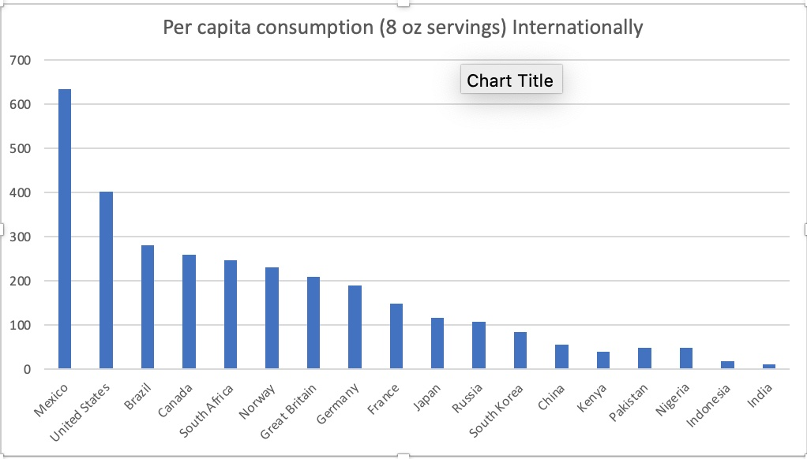
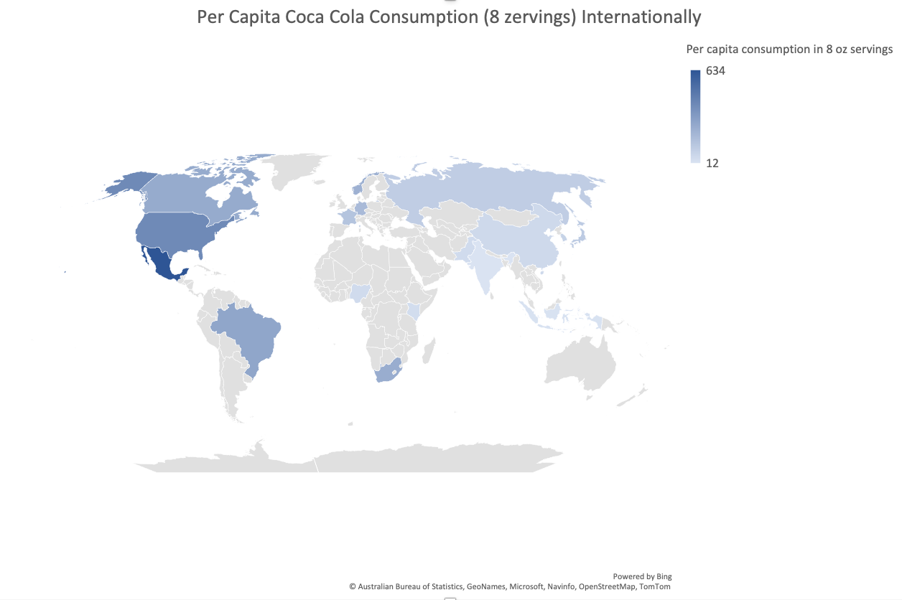
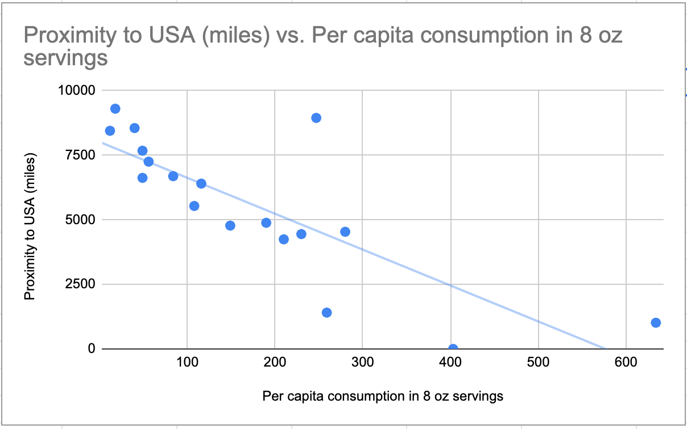
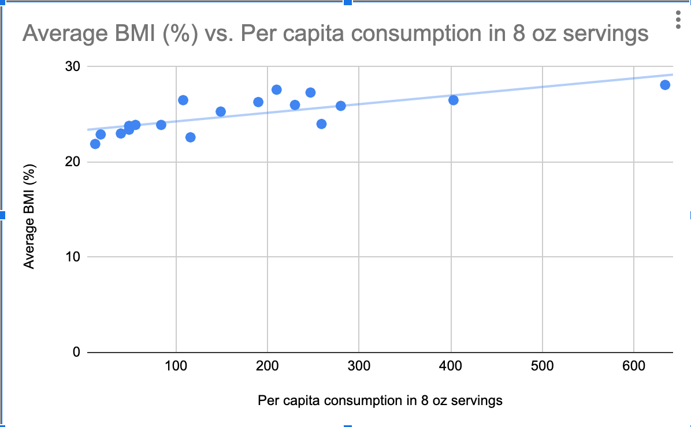

# Exploring Factors of National Coke Consumption 
In this project, I explored the data regarding the factors of national coke consumption across the globe in 19 different countries from different continents across the world in a data set that I found through the National Beverage Digest.

## Introduction
To explore the questions of what factors contribute to national coke consumption, I utilized data analysis techniques and Java to understand this data set further. I explored fundamental questions behind what causes different characteristics of the highest national coke consumption per capita in each country with programming skills and data analysis, mainly employed through the coding language Java. Finally, I came up with these questions by researching the factors influencing the amount of national beverage consumption.

### General Motivation
I chose this data set because I love drinking coca cola and I find that when I have traveled abroad there are different levels of consumption in different places that I go. For example, when I have traveled to places in Europe I felt as though more people were drinking coca cola, and I was curious to investigate this. I have always loved soda and specifically coca cola has been my favorite out of all others, and the level of consumption I felt varied from place to place, so I was enticed to continue this discovery process.

### Questions
The first question regarding the data that I attempted to answer is if there is a relationship between the proximity of where coca cola originated (Atlanta, GA in USA) and to where it is the most popular, measured by the highest level of per capita consumption. Originally, the second question that I attempted to answer is if other soft drink beverages, like sprite or fanta, have the same highest consumption rate in other countries (like if coke is highest in one country, does that mean fanta will be the highest as well).

 Although, I did not continue with answering this question because I became more interested in the relationship of coca cola with other health factors. Instead, the second question that I attempted to answer is if there is a relationship between countries with the highest levels of obesity and the countries with the highest levels of consumption for coca cola. I set out to answer this question by looking at the average BMI of each of these countries, which is the most common measure of levels of obesity.

## Methods
### Dataset Source
This data set was generated from the Beverage Digest, a privately owned company which publishes and gathers data regarding non-alcoholc beverages. This data was compiled through national survey in each of the countries. I originally found this data set on the website, University Magazine from Canada, whose goal is to provides tips on Student Life, Financial, Career, Majors, Ranking, and Important news that will impact students. To discover specifically how my data set was created, I reached out to the company. An employee from Beverage Digest explained that they use cross references and a proprietary model to collect their data. 

### Privacy and Rights to Dataset
I am able to use this dataset because on the website of the Beverage Digest under the copyright and privacy section it allows users to each download one pdf/excel document version of the data. Additionally, the data can also be found on statista, which is a free, credible, online source with hundreds of thousands of data sets. Furthermore, there is a copyright section at the bottom of where the data set came from, indicating that it can be used for research purposes if the data will not be distributed.

### Process
I went about answering the questions by first gathering the data from outside sources that I would need, starting with the proximity of each of the countries to the United States of America. I did this by finding the distance in miles from the country on the original data set to the United states. I compiled a parallel data set containing the average distance in miles from each of the countries in my data set to the United States of America, the country of origin of Coca Cola. I also compiled a parallel data set for the average BMI (%) in each country for each of the countries listed on my orginal dataset.

### Question 1: Is there a relationship between levels of per capita consumption (8 oz servings) and levels of obesity (measured in BMI)?
For question 1, after compiling the data regarding the levels of per capita consumption of Coca Cola, I set out to use statistical analysis to determine if there was a relationship between the two data sets. Next, I looked at the data and determined if there was any correlation between which had the lowest distance but highest consumption per capita of coca cola using statistiacal analysis and Java features. To do this, I created a function to output the correlation coeffcient r, which determines if there is a linear relationship between two data sets. The correlation coefficient (r) is a statistical measure of the strength of the relationship between relative movements of variables. I determined that the Y or depedent variable is the level of per capita consumption in 8 oz servings and the X or dependent variable is the proximity to the place of origin of the country. I then looked at the output of the correlation coefficient and was able to more meaningfully draw conclusions with this new measure.

### Question 2: Is there a relationship between the proximity of the country to the USA (coca cola' origin) and countries with the highest level of per capita consumption?
To answer my second question regarding if there was a relationship between highest per capita consumption of coca cola and levels of obesity, I researched data on the average BMI of each country in my original data set. I collected data on the average BMI of indviduals per country, which is the most common measure of national obesity per country. Next, I employed Java techniques to parse through the data to find the countries with the highest BMI and see if there was any similarities between countries with the highest levels of per capita consumption. I was able to write two methods in Java to sucessfully determine the answer to my question. I decided to use a similar function as answering question 1, by finding a correlation coefficient for the data set. However, the independent variable x is the level of per capita consumption for 8 oz servings and the dependent variable Y is the levels of obesity, measured in average BMI (%).
 
### Challenges
One challenge that I ran into was when I was compiling data from the internet outside of my original data set from the Beverage Digest, I had to ensure that it was coming from reputable sources when I was pulling the data from Google. To go about solving this issue, I made sure to only find data coming from places with .gov or national affiliation, instead of just choosing the first statistic that I found. Another challenge that I faced was determining the overlap in data and because the sample size was relatively small, it was difficult to make meaningful conclusions. My sample size of only 19 countries does not include the whole global perspective of all countries, so I was limited in the amnount of conclusion and correlation that i was able to draw. However, to solve this problem I decided to only work in the confines of my data set and determine if there were any relationships that I could draw.

Another challenge that I faced was determining what the appropriate types of function employment were to actually find the best ways to use Java to answer my questions. To overcome this difficulty, I used detailed psuedocode, which is the outline of the basis for my code, and thought about the steps I wanted to achieve before writing the actual code. I also tapped into my knowledge of statistics and used linear regression knowledge and finding an r value, which is the most common method of determining if there is a relationship between two different variables.

## Results and Conclusions
In my results, I found that the correlation coefficient between the level of per capita consumption and the proximity to the place of origin of coca cola, USA is 

Next, the test that I conducted to obtain the correlation coefficient showed that the relationship between the proximity of country to the place of origin the highest levels of per capita consumption was r = . This means that there is 

### Further Research
If I had more time and resources that I would utilize to continue analyzing and understanding this data set is the distribution pathways and availability of coca cola in each of these countries. For example, I would look into the question regarding if the reason that there is higher consumption in some places over others is because of the larger accesibility to distribution networks and the amount that each is available in stores or other places.

### How to improve statistical design
In order to improve my statistical design, if I had more resources and time I would eliminate the process of having to manually compile the data set regarding the proximity of the countries to the countries that I was intially analyzing and the levels of obesity. For example, I had to manually input and google each of the average BMI and distances to USA for each of the countries and put it into my file, which created more room for error. If I was able to write another program that would match the parallel data sets, this would improve my project.

### Bar Graph 
In order to visualize the data that I was working with, I constructed a simple bar chart to display the quantitative data of the comparison of each country with their average coca cola conusmption levels per capita for the 19 countries.

### World Graph
Additionally, I used another feature to visualize my data that displays the distributio and relative quantities of per capita consumption of coca cola across the world by country. The darker and more saturated countries represent higher per capita consumption and the lighter less saturated countries represent the lower amounts of per capita consumption.

### Scatter Plot to visualize linear relationships

